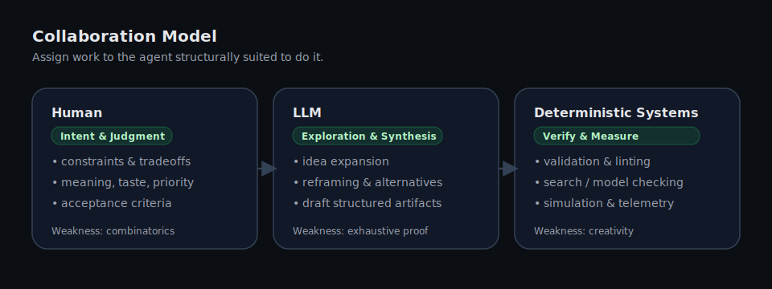
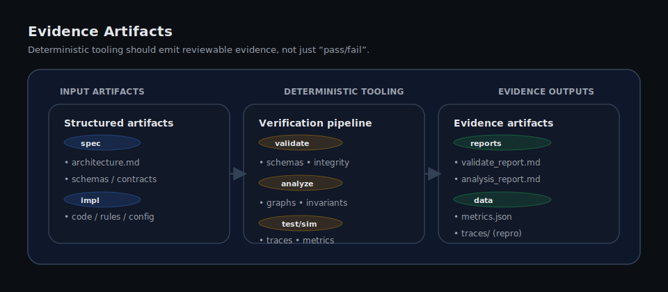
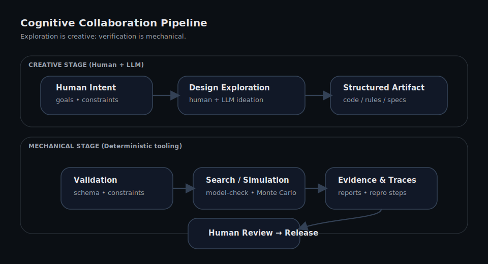
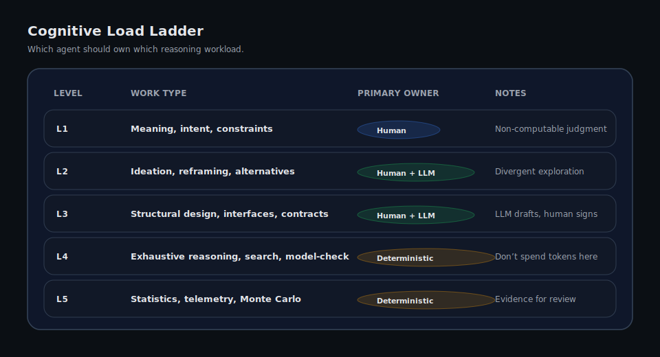

# Cognitive Task Partitioning for Human–AI Software Development

### Stop Asking the Eagle to Dig

A short engineering paper describing an architecture for **AI-assisted development workflows** that combines human reasoning, language models, and deterministic systems.

# 30-Second Summary

Modern software systems increasingly involve **three different forms of cognition**:

| Agent                 | Strength                            |
| --------------------- | ----------------------------------- |
| Humans                | intent, judgment, constraints       |
| LLMs                  | pattern synthesis, idea exploration |
| Deterministic systems | verification, search, simulation    |

Treating these as interchangeable leads to fragile systems.

This paper proposes a simple architectural principle:

**Cognitive Task Partitioning**

> Assign each cognitive task to the agent structurally suited to perform it.

This principle echoes an old engineering lesson: different agents excel at different forms of reasoning. Asking them to perform the wrong kind of work creates fragile systems.

---

## Status and Citation

**Status:** v0.1 — stable draft, intended for discussion and iteration.

If you reference this work:

> Majewski, Richard. *Cognitive Task Partitioning for Human–AI Software Development.* 2026.  
> GitHub repository: https://github.com/UglyEgg/<repo-name>

**Scope:** This repo describes an engineering workflow architecture. It is not a claim of novel ML research.

---

# Core Insight

AI tools can now generate complex systems faster than engineers can reason about them.

Without deterministic verification layers, this creates systems that:

- exceed human reasoning capacity

- accumulate hidden failure modes

- cannot be reliably validated

The solution is **not to remove humans from the loop**, but to **structure collaboration between humans, AI, and deterministic tooling**.

# The Practical Rule

In AI-assisted development, one rule keeps systems understandable:

> **AI generates possibilities.
> Deterministic systems prove them.**

This rule leads to a simple workflow discipline:

1. Use humans and LLMs to explore the design space.
2. Convert candidate designs into structured artifacts.
3. Run deterministic validation, analysis, and simulation.
4. Review the resulting evidence artifacts.

The key constraint is simple:

**AI-assisted exploration must never bypass deterministic verification layers.**

# The Collaboration Model



The workflow separates **exploration** from **verification**.

AI assists with idea expansion and design exploration, while deterministic tooling performs exhaustive reasoning and validation.

## Evidence Artifacts

Deterministic verification layers should emit **reviewable evidence artifacts**, not only pass/fail signals.



---


# Abstract

Large language models have dramatically changed how software can be developed. However, most current usage treats AI either as a code generator or as a replacement engineer. Both approaches ignore the structural strengths and weaknesses of humans, LLMs, and deterministic computers.

This paper proposes a development architecture based on **cognitive task partitioning**: assigning work to the agent best suited to perform it. Humans provide judgment and intent, LLMs expand the design space, and deterministic systems perform verification, search, and simulation.

The result is a development pipeline that increases creative throughput without sacrificing correctness.

---

# 1. The Current AI Development Problem

AI coding tools are widely adopted, but their use typically falls into one of two patterns.

## Pattern 1 — AI as Code Generator

```
Prompt → AI generates code → run code
```

This improves typing speed but does not fundamentally change engineering workflow.

## Pattern 2 — AI as Replacement Engineer

```
Problem → AI generates entire system
```

This introduces a new problem: AI can produce code faster than engineers can reason about its behavior.

The result is systems whose complexity exceeds the team’s ability to understand them.

Both models treat AI as a substitute for engineering cognition rather than a complementary capability.

# 2. Failure Modes of Naive AI Development

Several failure patterns appear when AI is used without architectural guardrails.

### Combinatorial reasoning in the prompt

Developers frequently ask LLMs to reason through large interaction spaces.

Examples include:

- predicting behavior across many interacting rules
- evaluating edge cases in large state spaces
- reasoning about probability distributions

LLMs are not optimized for exhaustive reasoning. Deterministic systems perform these tasks far more reliably.

### Verification by intuition

Generated systems are often validated by reading code rather than by simulation or analysis.

This shifts cognitive burden onto humans instead of tooling.

### AI bypassing the toolchain

When AI output is treated as authoritative, generated artifacts bypass the verification layers that normally guarantee correctness.

The result is fragile systems whose behavior is poorly understood.

# 3. Cognitive Task Partitioning

Effective AI-assisted development requires deliberate separation of cognitive work between three agents.

| Agent                 | Strength                    | Weakness             |
| --------------------- | --------------------------- | -------------------- |
| Humans                | meaning, judgment, intent   | combinatorics        |
| LLMs                  | pattern synthesis, ideation | exhaustive reasoning |
| Deterministic systems | search, proof, statistics   | creativity           |

A practical rule follows:

> Do not assign a cognitive task to an agent that is structurally bad at it.

# 4. Engineering Principles

Several practical principles follow from this model.

1. Exploration and verification must be separate stages
2. Creative reasoning should never bypass deterministic validation
3. Engineers should review evidence rather than simulate complex systems mentally
4. LLMs expand the design space; deterministic systems constrain it

# 5. The Cognitive Collaboration Pipeline



The key rule is simple:

**AI-assisted exploration must never bypass deterministic verification layers.**

# 6. The Cognitive Load Ladder



Different forms of reasoning belong to different agents.

# 7. Worked Example: Rule-Driven Systems

Consider a rule-driven system designed using this model.

For a concrete walkthrough of the verification workflow described here, see:

- **[`examples/rule-engine-pipeline.md`](examples/rule-engine-pipeline.md)**

For a general reproducibility contract for AI-assisted work, see:

- **[`REPRO.md`](REPRO.md)**

Design session:

```
Human + LLM explore rule interactions
```

Artifact produced:

```
rules.toml
module.toml
```

Deterministic tooling:

```
validate → analyze → model-check → simulate
```

Outputs:

```
review_report.md
simulation traces
state exploration results
```

Engineers evaluate **evidence**, not mental combinatorics.

# 8. Case Study: Storyforge

Storyforge is a deterministic rule engine designed for modular simulation systems.

Instead of embedding behavior in scripts or procedural logic, Storyforge expresses behavior as:

```
Trigger → Conditions → Effects
```

Modules define behavior through rule sets operating on bounded world state.

Because the rule system is deterministic, modules can be automatically analyzed using:

- rule reachability analysis
- dependency graph inspection
- bounded state exploration
- Monte Carlo simulation

# 9. Real-World Applications

Although illustrated with a rule engine, this architecture applies broadly.

### Infrastructure Engineering

AI assists with architecture exploration while deterministic systems validate CI pipelines and deployments.

### Security Engineering

LLMs generate threat hypotheses while deterministic systems perform fuzzing and symbolic analysis.

### Simulation Systems

AI explores system behaviors while automated simulation detects instability and unintended interactions.

### Data Engineering

AI proposes data models while deterministic tooling validates schemas and lineage graphs.

Across these domains the pattern remains consistent:

**Exploration is creative.**
**Verification is mechanical.**

# 10. When This Model Fails

Cognitive Task Partitioning performs poorly when:

- deterministic validation tooling does not exist
- systems cannot be simulated or analyzed
- outputs are subjective rather than testable

Recognizing these limits is essential.

Importantly, this limitation is not accidental.
AI-assisted development dramatically expands the design space of possible systems.
As exploration capacity increases, engineering must expand verification capacity as well.

In other words:

> AI generates possibilities.
> Deterministic systems must increasingly prove them.

# Conclusion

AI collaboration works best when cognition is partitioned deliberately.

Humans provide meaning and intent.
LLMs expand the design space.
Deterministic systems perform exhaustive reasoning and verification.

> **Humans and AI generate possibilities.
> Deterministic systems prove them.**

AI-assisted development therefore increases the long-term importance of deterministic verification systems.

---


# Author

**Richard Majewski**
*Systems engineer focused on deterministic systems, reproducible infrastructure, and rule-driven architectures.*

---


# Appendix: The Eagle and the Weasel

The title of this paper comes from advice a manager gave me early in my career.

In 2002 he explained how engineers approach problems differently:

> *"There are eagles and there are weasels.
> I'm not going to ask a weasel to fly,
> and I'm not going to ask an eagle to hunt underground."*

His point was simple: people succeed when their work matches how they think.

The same principle applies to AI systems.

Humans, language models, and deterministic computers all reason differently.
Expecting them to perform the same tasks leads to fragile systems.

Engineering architectures should respect those differences.

---


# Related Work

[**termgrid-core**](https://termgrid.entropy.quest/)
Deterministic terminal grid rendering engine

[**podCI**](https://podci.entropy.quest/)  
Reproducible containerized CI system

[**Storyforge**](https://github.com/UglyEgg/storyforge)
Rule-driven simulation engine
